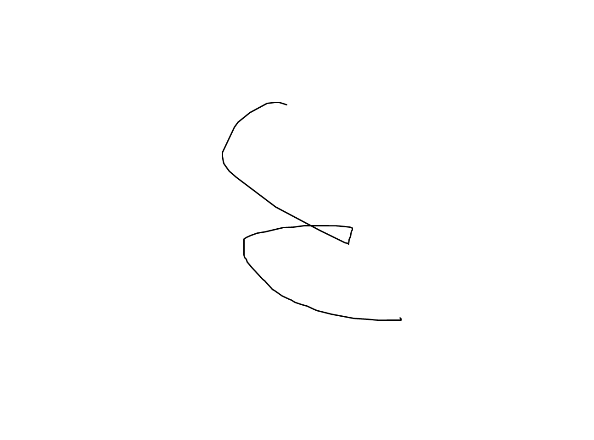
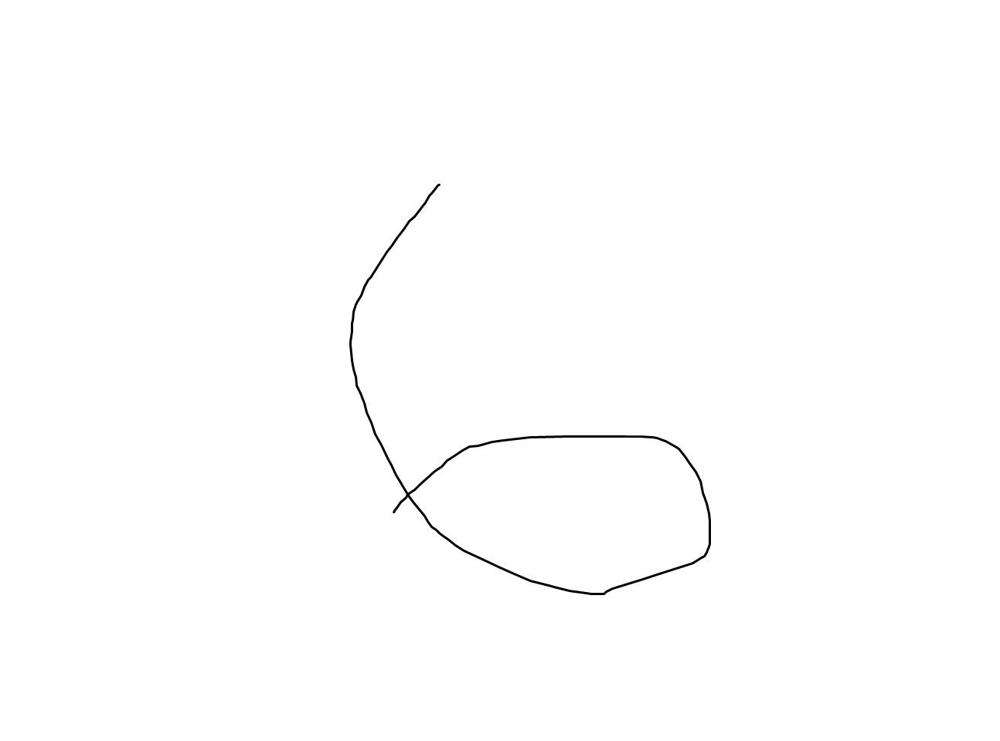
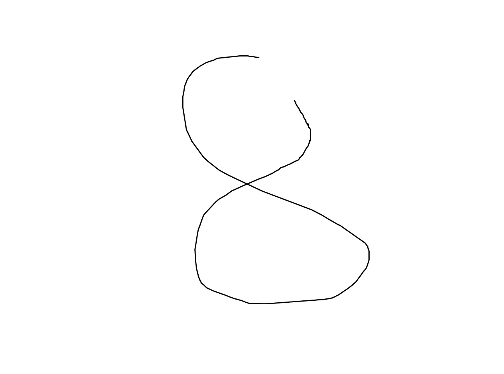

# MNIST CNN 手写数字识别

基于 PyTorch 实现的手写数字识别项目，使用卷积神经网络（CNN）在 MNIST 数据集上训练模型，并支持对本地图片进行数字预测。

## 技术栈

- Python
- PyTorch
- torchvision
- Pillow
- MNIST 数据集

## 功能

- 使用 `torchvision.datasets.MNIST` 自动下载并加载 MNIST 数据集
- 基于 CNN 完成 `0-9` 手写数字分类
- 使用 `CrossEntropyLoss` 进行多分类训练
- 使用 `Adam` 优化器更新模型参数
- 支持 CPU / CUDA 自动选择运行设备
- 训练完成后保存模型权重到 `mnist_cnn.pth`
- 支持命令行图片预测，并输出每个数字的概率

## 项目结构

```text
.
├── examples/         # 示例图片
├── mnist_cnn.py      # 模型定义、数据加载、训练与测试
├── predict.py        # 加载模型并预测本地图片
├── requirements.txt  # Python 依赖
├── .gitignore        # Git 忽略规则
└── README.md
```

## 本地运行

建议使用 Python 3.10 或更新版本。

```bash
pip install -r requirements.txt
```

训练模型：

```bash
python mnist_cnn.py
```

训练脚本会自动下载 MNIST 数据集，并在训练完成后生成 `mnist_cnn.pth`。

预测本地图片：

```bash
python predict.py my_digit.png
```

## 效果示例

下面是几张可以用来测试的简单示例图片，图片文件放在 `examples/` 目录中。

| 情况 | 示例图片 | 说明 |
| --- | --- | --- |
| 手写数字 `3` |  | 线条比较细，和 MNIST 中粗一些的数字不完全一样。 |
| 手写数字 `6` |  | 数字整体比较大，位置也不是完全居中，适合测试预处理效果。 |
| 手写数字 `8` |  | 这是比较常见的手写数字形状，可以用来观察模型是否能识别连笔情况。 |

可以用下面的命令测试：

```bash
python predict.py examples/3.png
python predict.py examples/6.png
python predict.py examples/8.png
```

这些图片主要是为了展示输入效果。实际识别结果会受到模型训练情况、图片清晰度、数字位置和预处理方式的影响。

## 模型结构

本项目使用一个轻量级 CNN 网络：

- 输入：`1 x 28 x 28` 灰度图像
- 卷积层 1：`1 -> 32`，卷积核大小 `3x3`
- 最大池化：将特征图尺寸减半
- 卷积层 2：`32 -> 64`，卷积核大小 `3x3`
- 最大池化：继续压缩空间尺寸
- 全连接层：`64 * 7 * 7 -> 128`
- Dropout：降低过拟合风险
- 输出层：`128 -> 10`，对应数字 `0-9`

整体流程是：先通过卷积层提取笔画、边缘、局部形状等特征，再通过全连接层完成数字分类。

## 数据预处理

训练阶段对 MNIST 图像进行了两步处理：

- `ToTensor()`：将图像转换为张量
- `Normalize((0.1307,), (0.3081,))`：使用 MNIST 的均值和标准差进行归一化

在预测自定义图片时，项目会将图像转换为灰度图，并缩放到 `28x28`，尽量让输入格式接近 MNIST 数据集。

## 我学到了什么

通过这个项目，我完整走了一遍深度学习图像分类任务的基本流程：数据加载、数据预处理、模型搭建、损失计算、反向传播、参数更新、模型保存和模型推理。

我更加直观地理解了 CNN 为什么适合图像任务。卷积层可以从局部区域中学习笔画和边缘特征，池化层可以压缩特征并增强一定的平移鲁棒性，全连接层则负责把提取到的图像特征映射到具体类别。

这个项目也让我认识到，模型效果不仅取决于网络结构，推理阶段的输入处理同样重要。如果自己导入的图片和训练数据分布差异过大，即使模型在测试集上表现不错，也可能出现识别不稳定的问题。因此，保持训练和预测阶段的数据格式一致，是机器学习项目中非常关键的一步。

## 项目不足

这个项目目前还是一个比较基础的练习项目，主要目的是把 CNN 训练和图片预测的流程跑通，所以还有一些明显不足：

- 训练数据只使用了 MNIST，图片比较规整，和真实拍照、截图、手写板输入的数字还是有差距。比如手机拍出来的数字可能有阴影，截图里的数字也可能不是标准的黑白格式。
- 模型结构比较简单，没有做很多参数调整，也没有和其他模型进行对比。比如没有尝试更多卷积层，也没有记录不同参数下准确率的变化。
- 本地图片预测的预处理还不够完善，如果图片背景复杂、数字不居中、颜色反差不明显，识别结果可能不稳定。例如数字太靠边、线条太细、背景不是纯白色时，就可能影响判断。
- `mnist_cnn.py` 和 `predict.py` 中有重复的模型结构代码，以后如果修改网络，需要记得两个文件一起改。
- 目前只会输出预测结果和概率，没有整理识别错误的图片，所以还不能很清楚地分析模型容易错在哪里。

## 后续开发方向

如果后续继续完善这个项目，可以从一些比较实际的小功能开始：

- 增加一个简单的手写画板，让用户直接在窗口里写数字并进行识别，比如写完后点击“预测”按钮显示结果。
- 把 CNN 模型单独放到一个文件中，训练和预测时都从同一个地方导入，减少重复代码。
- 尝试加入简单的数据增强，比如轻微旋转、平移、缩放，让模型适应更多不同写法。
- 改进本地图片的预处理流程，例如自动裁剪数字区域、调整黑白颜色、让数字居中，减少手动处理图片的麻烦。
- 保存一些预测失败的例子，观察模型主要错在什么情况，再针对性改进。
- 如果之后能力提升，可以尝试做一个简单网页或小程序版本，让项目展示起来更方便，比如上传一张图片后直接显示预测结果。

## 参考链接

- [PyTorch 官方文档](https://docs.pytorch.org/docs/stable/index.html)
- [torchvision MNIST 数据集](https://docs.pytorch.org/vision/main/generated/torchvision.datasets.MNIST.html)
- [MNIST 官方数据集](https://yann.lecun.com/exdb/mnist/)
- [Pillow 文档](https://pillow.readthedocs.io/)
